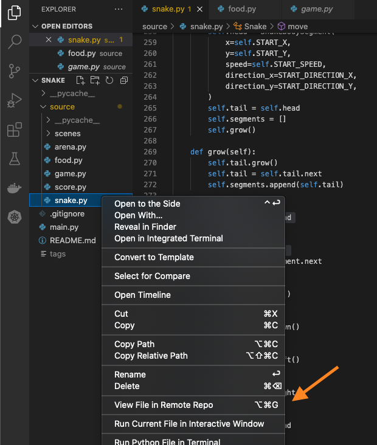
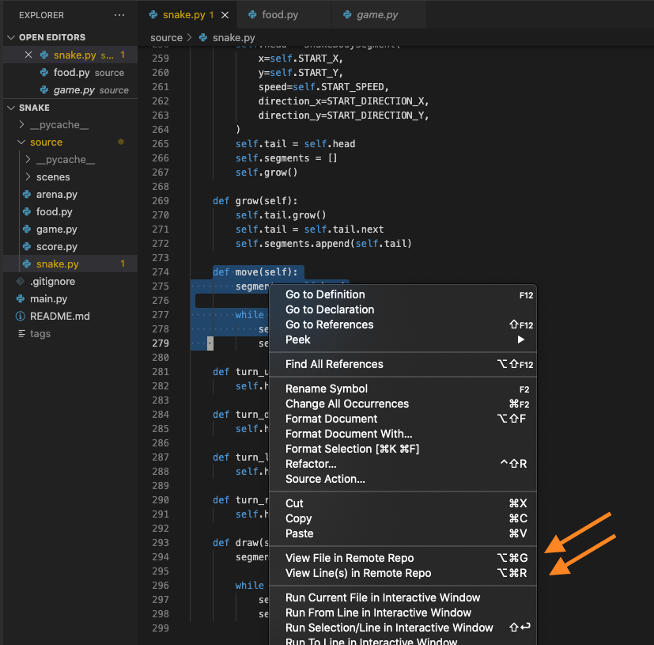

# gropen.vscode

A VS Code extension for quickly opening local files and directories in remote git repositories.

This plugin was thought out to make it a breeze to share git-versioned code with your coworkers.

## Features

### Opening Code in Remote Repos

Right click on the file in the explorer then choose to view file in remote repo:

Right click on the file in the editor then choose to view file, line or selected lines in remote repo:

### Keybindings

| Feature                        | Keybindings (windows / mac) | Command Palette       |
| -------------------------------|:---------------------------:| :--------------------:|
| Open file in remote repo       | ctrl+alt+g / alt+cmd+g      | > Gropen File         |
| Open line in remote repo       | ctrl+alt+l / alt+cmd+l      | > Gropen Current Line |
| Open line range in remote repo | ctrl+alt+r / alt+cmd+r      | > Gropen Line Range   |

## Requirements

1. Python >= 3.6
2. Git
3. [gropen](https://github.com/tiagopog/gropen) (`pip install gropen`)

## Release Notes

### 0.2.0

Add support for opening files in remote repos by right clicking on files in the explorer
or in the editor context.

### 0.1.0

Initial release of `gropen-vscode`.

## Following extension guidelines

If you want to contribute with this extension please make sure that you've read through the extensions guidelines
and follow the best practices for creating your extension.

* [Extension Guidelines](https://code.visualstudio.com/api/references/extension-guidelines)
